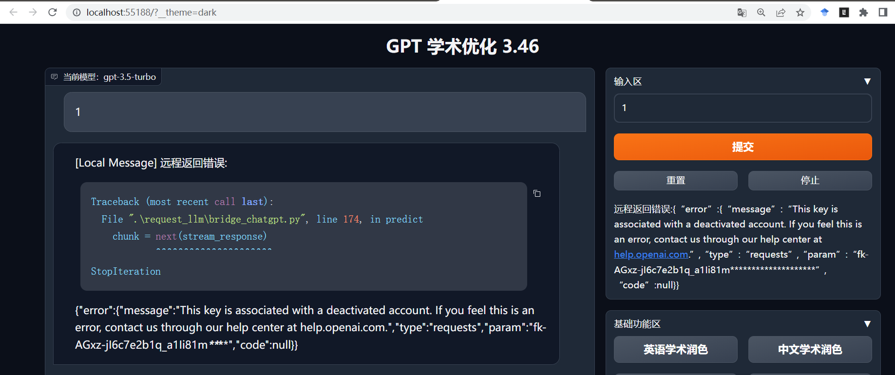

#  | FreeAI

**OpenAI should not be a closed AI.**

你是否还在为OpenAI需要科学上网在犯愁？

你是否还在为OpenAI的付费模式而望而却步？

你是否苦恼没有免费的API Key来开发自己的ChatGPT工具？

本项目综述Github众优秀开发者的努力，给出一个比较完美的解决方案，并持续向更好用、更强大、更便宜的AI开放努力。**如果你喜欢本项目，请给一个免费的star，谢谢！**

`Tips：有些一般性的问题和提醒，我在写在本页面并加注提醒了。大家实操时先耐心看完自己需要的本教程那一part，以免重复提问浪费等待时间。`

---
#### 2023年7月16日上线FreeAI：
+ 基于Pandora和OpenAIAuth实现免翻墙使用ChatGPT 3.5;
+ 演示配置gpt_academic (vension: 3.45)实现免翻墙免费使用ChatGPT 3.5;
  
#### **2023年8月1日更新要点：**
+ 提供一个自己制作的Pool Token (10个账号组成)；
+ 废弃OpenAIAuth。新提供一个免科学上网获取自己OpenAI账号的Access Token （即用户Cookie）的方法，以便制作自己的Pandora Shore Token和Pool Token;
+ 基于gpt_academic (vension: 3.47)演示免科学上网使用`ChatGPT 3.5`；
+ 穿插一些issue反馈的常见问题的解决方案。
---

**鸣谢：**
+ [pengzhile/pandora](https://github.com/pengzhile/pandora)：让OpenAI GPT-3.5的API免费和免科学上网的关键技术。
+ [binary-husky/gpt_academic](https://github.com/binary-husky/gpt_academic), 以它为例，解决它需翻墙和需要付费的OpenAI API key的问题，演示OpenAI变为FreeAI。

## Pandora
旨在打造免科学上网情况下，最原汁原味的ChatGPT。基于access token的[技术原理](https://zhile.io/2023/05/19/how-to-get-chatgpt-access-token-via-pkce.html)实现的。目前有官方的体验网站[https://chat.zhile.io](https://chat.zhile.io)，需要使用OpenAI的账户密码，所有对话记录与在官网的一致；也有基于Pandora技术的共享[Shared Chat](https://baipiao.io/chatgpt)的资源池，无需账号密码也能体验。`Tips：现Shared Chat的体验有些卡顿是正常现象，毕竟人太多了。`

Pandora项目最难能可贵的是提供了可将用户的Cookie转化为形式如同API key的Access Token和响应这个Access Token的反代接口（也可响应OpenAI原生的API key）的服务，此举无疑是基于OpenAI自由开发者最大的福音。详情请见：[“这个服务旨在模拟 Turbo API，免费且使用的是ChatGPT的8k模型”](https://github.com/pengzhile/pandora/issues/837)。
+ 免科学上网获取自己的用户Cookie（即ChatGPT的Access Toke），演示地址：[https://ai-20230626.fakeopen.com/auth](https://ai-20230626.fakeopen.com/auth)和[https://ai-20230626.fakeopen.com/auth1](https://ai-20230626.fakeopen.com/auth1)；`Tips：Pandora后台记不记录你的用户账号密码不知道，但确实好用。`
+ Cookie转 `fk-`开头、43位的 Share Token 演示地址：[https://ai.fakeopen.com/token](https://ai.fakeopen.com/token)；
+ Cookie转 `pk-`开头、43位的 Pool Token 演示地址：[https://ai.fakeopen.com/pool](https://ai.fakeopen.com/pool)。解决多账号并发的问题；
+ 响应上述 Access Token 的反代接口是：[https://ai.fakeopen.com/v1/chat/completions](https://ai.fakeopen.com/v1/chat/completions)。

Pandora项目还提供了两个免费的Pool Token:
+ `pk-this-is-a-real-free-pool-token-for-everyone` 很多 Share Token 组成的池子。
+ ~~`pk-this-is-a-real-free-api-key-pk-for-everyone`~~ 一些120刀 Api Key组成的池子。`（我测试的时候已经没钱了，[衰]，继续使用会经常报错，所以别用了。）`

经使用自己的账号生成的Share Token和Pool Token进行测试，这种方式进行的对话的记录，不会出现在该账户记录中。`但Pandora论坛帖子有人在反馈将这一部分的对话记录给保存到账户对话记录中，所以以后会不会有变化，不好说。`

本人十分中意ChatGPT的翻译效果，所以编写一个基于Pandora的简易翻译服务的网页，即文件[Translate.html](https://github.com/elphen-wang/FreeAI/blob/main/Translate.html)，测试效果表明还可以。`Tips：使用的是Pandora提供的Pool Token。`
## FreeAI来提供自己Pool Token啦

我**之前**因为自己的池子不够大，且用户cookie的生命周期只有**14天**，时常更新Access Token也很烦，所以我使用的是Pandora提供Pool Token。但是，经过一段时间实操，发现大家（包括我）都遇到类似于以下的报错：

 

我**猜想**这是因为Pandora提供的免费Pool Token是由约100个账号组成的池子，而每个账号的Access Token生命周期只有14天且应该产生日期不尽相同，所以这个Pool Token需要经常更新下属这100个账号的Access Token，不然就会出现上述的报错。实际上，也是正因为如此，这种的报错持续一两天就会自动消失，这也说明这个Pool Token更新机制有所压力或未完善。**之前本教程基于 [OpenAIAuth](https://github.com/acheong08/OpenAIAuth)** 提供了[一个免科学上网获取专属自己的Pandora的Share Token和Pool Token](https://github.com/elphen-wang/FreeAI/blob/main/old/gpt_academic_old/get_freeai_api.py)的方式。但是，经过实测，OpenAIAuth所依靠的**服务机器响应请求有压力，时常获取不了自己的账号的Access Token**，故寻找一个替代方式是十分有必要的。**这些，无疑都是十分糟糕的用户体验。**

由此，FreeAI来提供自己Pool Token啦。大家可以通过以下的链接获取FreeAI Pool Token：
[https://api.elphen.site/api?mode=default_my_poolkey](https://api.elphen.site/api?mode=default_my_poolkey) 。

大家在使用这个链接时，**请注意以下几点**：
+ 这个链接提供的FreeAI Pool Token是**每天凌晨4点10分定时更新**的，注意它的内容**并不长久固定**，目前暂定它的生命周期为一天，所以大家**一天取一次即可**；
+ 这个池子挂靠的服务器是我的轻量云服务器，**请大家轻虐，不要频繁访问**。
+ 这个FreeAI Pool Token是由10个OpenAI账号组成的。池子虽不大，但应该够用。将来会继续扩展这个池子。
+ python 获取这个FreeAI Pool Token代码如下:
  
``` .python
import requests,json
response = requests.get("https://api.elphen.site/api?mode=default_my_poolkey")
if response.status_code == 200:
    FreeAI_Pool_Token=response.json()
```

 大家也可以通过Pandora项目提供的API，制作专属自己的Pandora Token：
``` .python
import requests,json
#免科学上网，获取自己OpenAI账户的Access Token
#Tips：Pandora后台记不记录你的用户账号密码不知道，但确实好用。
data0 = {'username': username, #你OpenAI的账户
        'password': password, #你OpenAI的密码
        'prompt': 'login',}
resp0 = requests.post('https://ai-20230626.fakeopen.com/auth/login', data=data0)
if resp0.status_code == 200:
    your_openai_cookie=resp0.json()['access_token']

#获取专属自己的Pandora Token
data1 = {'unique_name': 'get my token', #可以不用修改
        'access_token': your_openai_cookie,
        'expires_in': 0,
        }
resp1 = requests.post('https://ai.fakeopen.com/token/register', data=data1)
if resp1.status_code == 200:
    your_panroda_token= resp.json()['token_key']  
```
要制作专属自己的Pandora Pool Token，先假定你已经获取了两个及以上账号的Pandora （Share）Token组成的数组your_panroda_token_list，然后可用如下python代码获取：
``` .python
data2 = {'share_tokens': '\n'.join(your_panroda_token_list),}
resp2 = requests.post('https://ai.fakeopen.com/pool/update', data=data2)
if resp2.status_code == 200:
    your_pool_token=resp2.json()['pool_token']
```

本教程的[get_freeai_api_v2.py](get_freeai_api_v2.py)即是一个获取Pandora （Share/Pool）Token的完整演示程序。

**强烈建议大家使用自己的Pandora Token。并且，请大家优化代码，不要频繁发起请求，让提供服务的服务器（个人开发者的服务器性能一般不高）承载极限压力，最终反噬自己的请求响应缓慢。**

## gpt_academic
本人之前搭建专属自己的OpenAI API反向代理的教程[ChatGPT Wallfree](https://github.com/elphen-wang/chatgpt_wallfree)只实现了gpt_academic免科学上网功能，但仍需使用OpenAI原生的API key。这里还是以它为例，本次直接不用开发者自己搭建反向代理服务和OpenAI原生的API key，可以为一般的科研组省下一笔的不易报销的经费支出。

开发者可使用本项目中[gpt_academic](https://github.com/elphen-wang/FreeAI/tree/main/gpt_academic)文件夹中文件替代官方的文件（`主要是修改对toolbox.py和config.py对Pandora Token的识别和获取`），也可在此基础上加入自己的设定（如gpt_academic账户密码等）。如此之后，安装官方的调试运行和部署指引，gpt_academic就可以不用科学上网又能免费使用gpt-3.5啦！

**部署教程**：
   +  由于之前发现gpt_academic设定用户参数配置的读取优先级: 环境变量 > config_private.py > config.py，所以调试中，最好config.py文件也做对应的修改（即改为一样）。不然，用户的配置可能在某些调试情况下不生效，这是gpt_academic的bug，我目前没有对此进行修改。**我的建议是：干脆就别配置config_private.py，即删掉或别生成config_private.py文件，或者这两文件弄成一模一样。**
   + 本项目中[gpt_academic](https://github.com/elphen-wang/FreeAI/tree/main/gpt_academic)文件夹下的文件替代官方的对应的文件并做一定的修改即可。测试用的是gpt_academic v3.47的版本。
      `这里说明几点：`
      + `requirements.txt`相对官方增加pdfminer，pdflatex，apscheduler，前两个是latex功能相关的包，后一个是定时更新API_KEY的包，也即只有apscheduler是必须的。大家据此也可以做相应的代码更改以使用专属自己的Pandora token;
      + `toolbox.py`相关官方增加识别Pandora Token的功能；
      + `config.py`中增加了定时获取FreeAI提供的Pool Token，修改了API_URL_REDIRECT反代端口（不然处理不了Pandora Token），WEB_PORT为86（数字随便取你喜欢的）。你也可以增设访问gpt_academic的账户密码和其他功能。
   + docker模型一般编译是：
  ```bash {.line-numbers}
  #编译 docker 镜像
  docker build -t gpt-academic .
  #端口可以自由更换，保持和config.py一样即可
  docker run -d --restart=always -p 86:86 --name gpt-academic gpt-academic
  ``` 
   + 要使用gpt_academic arxiv翻译功能，在docker模式下，需要进行以下编译：
   ``` bash {.line-numbers}
   #编译 docker 镜像
   docker build -t gpt-academic-nolocal-latex -f docs/GithubAction+NoLocal+Latex .
   #端口可以自由更换，保持和config.py和config_private.py中设置的一样即可
   #/home/fuqingxu/arxiv_cache是docker容器外的文件夹，存放arxiv相关的内容。具体路经可以修改为你喜欢的
   run -d -v /home/fuqingxu/arxiv_cache:/root/arxiv_cache --net=host -p 86:86 --restart=always --name gpt-academic gpt-academic-nolocal-latex
   ```
## 后记
+ 因为，Pandora目前本质上是将OpenAI原生的网页服务还原出来，所以目前还不能免费使用诸如ChatGPT-4等付费服务。不过，这将是本人和一众致力于使AI技术服务更广大群众的开发者今后努力的方向。
+ 之前ChatGPT Wallfree教程中提及ZeroTier的内网穿透技术，实测不如[Frp](https://github.com/fatedier/frp)更适合中国科研宝宝的体质：更稳定、速度更快且第三方无需客户端。

## To-do List
+ [ ] 因为我目前是一名科研工作人员，未来将优先投入有限精力开发与arxiv相关的功能，集成我能且想要集成的服务。

## Star历史


